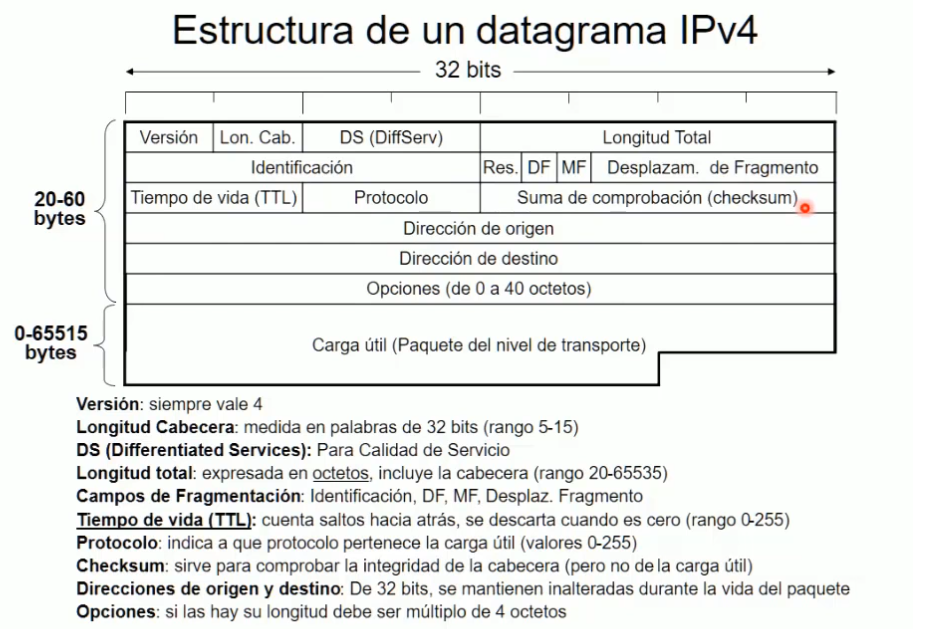

¡Entendido! Aquí tienes una versión ampliada y mejorada del documento original, conservando toda la información y añadiendo explicaciones más detalladas, ejemplos y contexto. Mi objetivo es que sea más claro, completo y educativo, sin reducir el contenido. 

---

# **Introducción a los conceptos básicos de redes**

Este documento abarca los fundamentos esenciales de las redes de computadoras, desde su arquitectura básica y topologías hasta conceptos avanzados como algoritmos de routing, protocolos y modelos de capas. El contenido está diseñado para proporcionar una base sólida tanto para principiantes como para quienes buscan profundizar en el diseño y funcionamiento de las redes modernas.

---

## **1. Fundamentos de redes y telemática**

### **1.1. Conceptos básicos de redes**
- **Definición:**  
  Una red de computadoras es un sistema de interconexión de dispositivos (nodos) que permite compartir recursos (archivos, impresoras, aplicaciones) y facilita la comunicación entre ellos.  
  - **Componentes esenciales:**  
    - **Nodos:** Dispositivos como computadoras, impresoras, teléfonos IP y servidores.  
    - **Enlaces:** Los medios de transmisión que conectan los nodos, como cables o señales inalámbricas.  
    - **Protocolos:** Reglas que definen cómo los datos deben ser enviados, recibidos y procesados.  

- **Objetivo principal:**  
  Garantizar una comunicación eficiente, confiable y segura entre los dispositivos conectados.

- **Ejemplo práctico:**  
  En una oficina, una red permite que todos los empleados compartan una impresora, accedan a los mismos archivos almacenados en un servidor central y se comuniquen a través de correo electrónico o aplicaciones de mensajería.

---

### **1.2. Historia y evolución**
- **Primeros pasos:**  
  Las redes comenzaron a desarrollarse en los años 60 con la creación de ARPANET, un proyecto del Departamento de Defensa de los Estados Unidos que sentó las bases de Internet al introducir la **conmutación de paquetes**.  
- **Telemática:**  
  Este término combina telecomunicaciones e informática, y se refiere a la transmisión de datos a larga distancia utilizando tecnologías como redes móviles, satelitales y de Internet.  
- **Evolución de Ethernet:**  
  - Introducida por Xerox en los años 70, Ethernet revolucionó las redes locales (LAN).  
  - Desde velocidades iniciales de 10 Mbps, ha evolucionado a **Fast Ethernet** (100 Mbps), **Gigabit Ethernet** (1 Gbps) y versiones más rápidas como **10/40/100 Gbps Ethernet**.  
  - Hoy en día, Ethernet es el estándar dominante para redes cableadas.

- **Importancia histórica:**  
  La evolución de las redes ha transformado la manera en que las personas trabajan, estudian y se comunican, permitiendo desde videollamadas hasta servicios en la nube.

---

### **1.3. Importancia de los estándares**
- **¿Qué son los estándares?**  
  Son normas técnicas que garantizan que los dispositivos de diferentes fabricantes puedan comunicarse entre sí, promoviendo la interoperabilidad y reduciendo costos.  
- **Organizaciones clave:**  
  - **ISO (Organización Internacional de Normalización):**  
    Responsable del modelo OSI, que estructura las funciones de red en capas.  
  - **IEEE (Instituto de Ingenieros Eléctricos y Electrónicos):**  
    Define estándares como **IEEE 802.3** (Ethernet) y **IEEE 802.11** (Wi-Fi).  
  - **IETF (Grupo de Trabajo de Ingeniería de Internet):**  
    Desarrolla protocolos como TCP/IP, HTTP y DNS.  
- **Ejemplo práctico:**  
  Gracias a los estándares, un teléfono de Apple puede conectarse a una red Wi-Fi generada por un router de TP-Link, y ambos funcionarán sin problemas.

---

## **2. Topologías y arquitectura de redes**

### **2.1. Topologías de red**
- **Definición:**  
  La topología de red describe cómo están organizados los dispositivos en una red, tanto físicamente (cómo están conectados) como lógicamente (cómo fluye la información).  
- **Tipos de topologías:**  
  - **Estrella:**  
    - **Descripción:** Todos los nodos están conectados a un nodo central, como un switch o hub.  
    - **Ventajas:**  
      - Fácil de instalar y gestionar.  
      - Si un nodo falla, no afecta al resto de la red.  
    - **Desventajas:**  
      - Alta dependencia del nodo central; si este falla, toda la red queda inoperativa.  
    - **Ejemplo:** Una red doméstica donde todos los dispositivos están conectados a un router Wi-Fi.  
  - **Anillo:**  
    - **Descripción:** Los nodos están conectados en un ciclo cerrado, donde cada dispositivo se conecta al siguiente.  
    - **Ventajas:**  
      - Ofrece redundancia al permitir que los datos viajen en ambas direcciones.  
    - **Desventajas:**  
      - Un fallo en un nodo puede interrumpir toda la red si no hay redundancia adicional.  
    - **Ejemplo:** Redes utilizadas en sistemas industriales antiguos.  
  - **Malla:**  
    - **Descripción:** Cada nodo está conectado a varios otros, proporcionando múltiples rutas para los datos.  
    - **Ventajas:**  
      - Máxima redundancia y fiabilidad; si un enlace falla, los datos pueden tomar otra ruta.  
    - **Desventajas:**  
      - Costosa y compleja de implementar debido al número de conexiones necesarias.  
    - **Ejemplo:** Redes de telecomunicaciones críticas, como las utilizadas por compañías telefónicas.

---

### **2.2. Medios de transmisión**
- **Definición:**  
  Los medios de transmisión son los canales físicos o inalámbricos a través de los cuales viajan los datos en una red.  
- **Tipos de medios:**  
  - **Cables de cobre:**  
    - **Par trenzado (UTP/STP):** Común en redes LAN, económico y fácil de instalar.  
    - **Cable coaxial:** Usado en redes antiguas y televisión por cable; ofrece mayor resistencia a interferencias.  
  - **Fibra óptica:**  
    - Transmite datos mediante pulsos de luz, ofreciendo altas velocidades y largas distancias.  
    - Ideal para redes troncales y conexiones intercontinentales.  
  - **Ondas de radio:**  
    - Utilizadas en redes inalámbricas como Wi-Fi, Bluetooth y comunicaciones satelitales.  
    - Ofrecen flexibilidad, pero son más susceptibles a interferencias.  
- **Ejemplo práctico:**  
  En una oficina moderna, se utilizan cables de fibra óptica para conectar los servidores principales, mientras que los empleados usan Wi-Fi para acceder a la red desde sus dispositivos.

---

### **2.3. Nodos terminales e intermedios**
- **Definición:**  
  Los nodos son los dispositivos que forman parte de una red. Según su función, pueden ser:  
  - **Nodos terminales:**  
    Dispositivos finales que envían o reciben datos, como computadoras, impresoras, teléfonos IP y cámaras de seguridad.  
  - **Nodos intermedios:**  
    Dispositivos que gestionan el tráfico de datos, como switches, routers y puntos de acceso inalámbricos.  
- **Ejemplo práctico:**  
  En una red doméstica, el router actúa como nodo intermedio, mientras que los teléfonos, computadoras y televisores inteligentes son nodos terminales.

---

### **2.4. Tipos de enlaces**
- **Simplex:**  
  Transmisión unidireccional, donde los datos solo fluyen en una dirección. Ejemplo: señales de televisión.  
- **Dúplex:**  
  Transmisión bidireccional:  
  - **Semidúplex:** Los datos viajan en ambas direcciones, pero no al mismo tiempo (como los walkie-talkies).  
  - **Dúplex completo:** Los datos viajan simultáneamente en ambas direcciones (como en una videollamada).  
- **Ejemplo práctico:**  
  Un enlace de fibra óptica entre dos centros de datos suele ser dúplex completo, permitiendo una comunicación simultánea en ambas direcciones.

---

## **3. Clasificación de redes**

### **3.1. Tipos de redes según su alcance**
- **LAN (Red de Área Local):**  
  - Redes limitadas a un área pequeña, como oficinas o hogares.  
  - Ofrecen alta velocidad y baja latencia.  
  - **Ejemplo:** Una red Wi-Fi en una cafetería.  
- **WAN (Red de Área Amplia):**  
  - Conectan redes en áreas geográficas extensas, como países o continentes.  
  - Utilizan tecnologías como fibra óptica, satélites y MPLS.  
  - **Ejemplo:** La red global de Internet.  
- **MAN (Red de Área Metropolitana):**  
  - Redes que conectan múltiples LANs dentro de una ciudad.  
  - **Ejemplo:** La red de una universidad con varios campus en la misma ciudad.  
- **PAN (Red de Área Personal):**  
  - Redes de corto alcance, como Bluetooth, diseñadas para dispositivos personales.  
  - **Ejemplo:** La conexión entre un teléfono y unos audífonos Bluetooth.

---

### **3.2. Métodos de transmisión**
- **Unicast:**  
  - Los datos se envían de un dispositivo a otro específico.  
  - **Ejemplo:** Un correo electrónico enviado a un destinatario.  
- **Broadcast:**  
  - Los datos se envían a todos los dispositivos de la red.  
  - **Ejemplo:** Un router enviando un mensaje ARP para descubrir dispositivos en la red.  
- **Multicast:**  
  - Los datos se envían a un grupo específico de dispositivos interesados.  
  - **Ejemplo:** Una transmisión en vivo de video para un grupo de usuarios.  
- **Anycast:**  
  - Los datos se envían a un grupo, pero solo uno responde, seleccionando el más cercano o eficiente.  
  - **Ejemplo:** Servidores DNS distribuidos globalmente para responder a consultas de usuarios.

---

## **4. Modelo de capas y protocolos**

### **4.1. El modelo OSI (Open Systems Interconnection)**
- **Definición:**  
  El modelo OSI es un marco conceptual que organiza las funciones de red en siete capas, cada una con roles específicos. Fue desarrollado por la ISO para estandarizar la comunicación entre dispositivos de diferentes fabricantes.  
- **Capas del modelo OSI:**  
  1. **Capa física:**  
     - Maneja la transmisión de datos en forma de señales eléctricas, ópticas o inalámbricas a través del medio de transmisión.  
     - **Ejemplo:** Cables, conectores, hubs.  
  2. **Capa de enlace de datos:**  
     - Asegura que los datos se transmitan sin errores entre dos nodos directamente conectados.  
     - **Ejemplo:** Direcciones MAC, switches.  
  3. **Capa de red:**  
     - Se encarga del direccionamiento y enrutamiento de paquetes entre redes.  
     - **Ejemplo:** Protocolo IP, routers.  
  4. **Capa de transporte:**  
     - Garantiza la entrega confiable de datos entre dispositivos mediante control de errores y reenvío.  
     - **Ejemplo:** Protocolos TCP y UDP.  
  5. **Capa de sesión:**  
     - Establece, gestiona y finaliza sesiones de comunicación entre aplicaciones.  
     - **Ejemplo:** Control de sesiones en videollamadas.  
  6. **Capa de presentación:**  
     - Traduce los datos a un formato comprensible para las aplicaciones. También maneja la encriptación y compresión.  
     - **Ejemplo:** Conversión de texto a ASCII, cifrado SSL/TLS.  
  7. **Capa de aplicación:**  
     - Proporciona servicios directos a las aplicaciones del usuario, como navegación web o transferencia de archivos.  
     - **Ejemplo:** HTTP, FTP, SMTP.  

- **Importancia:**  
  Este modelo no es utilizado directamente en las redes modernas, pero sirve como referencia para comprender cómo interactúan los diferentes componentes de una red.

---

### **4.2. El modelo TCP/IP**
- **Definición:**  
  Es el modelo práctico que rige Internet y muchas redes privadas. Tiene cuatro capas que cumplen funciones similares a las del modelo OSI.  
- **Capas del modelo TCP/IP:**  
  1. **Capa de acceso a la red:**  
     - Equivalente a las capas física y de enlace en el modelo OSI.  
     - Maneja la transmisión de datos entre dispositivos conectados directamente.  
  2. **Capa de Internet:**  
     - Responsable del direccionamiento y enrutamiento de paquetes.  
     - **Ejemplo:** Protocolo IP, ICMP.  
  3. **Capa de transporte:**  
     - Administra la comunicación entre aplicaciones mediante protocolos como TCP (confiable) y UDP (rápido pero no confiable).  
  4. **Capa de aplicación:**  
     - Proporciona servicios a las aplicaciones del usuario, como navegación web (HTTP) y correo electrónico (SMTP).  

- **Diferencias clave entre OSI y TCP/IP:**  
  - El modelo TCP/IP es más simple, con solo cuatro capas.  
  - TCP/IP está diseñado específicamente para Internet, mientras que OSI es más general.

---

## **5. Protocolos y control de acceso al medio**

### **5.1. Protocolos de nivel de enlace**
- **Definición:**  
  Los protocolos de nivel de enlace gestionan cómo los dispositivos acceden al medio de transmisión y cómo se detectan y corrigen errores durante la transmisión de datos.  

- **Control de acceso al medio (MAC):**  
  - Define cómo los dispositivos comparten el medio de transmisión para evitar colisiones.  
  - Métodos comunes:  
    - **CSMA/CD (Carrier Sense Multiple Access with Collision Detection):**  
      - Utilizado en redes Ethernet cableadas.  
      - Detecta colisiones y retransmite los datos después de un tiempo aleatorio.  
    - **CSMA/CA (Carrier Sense Multiple Access with Collision Avoidance):**  
      - Utilizado en redes inalámbricas como Wi-Fi.  
      - Intenta evitar colisiones solicitando permiso antes de transmitir.  

- **Estructura de tramas Ethernet:**  
  - Las tramas contienen:  
    - **Dirección MAC de origen y destino.**  
    - **Datos del mensaje.**  
    - **CRC (Cyclic Redundancy Check):** Un código para detectar errores.

---

## **6. Algoritmos de routing**

### **6.1. Conceptos básicos**
- **Definición:**  
  Los algoritmos de routing determinan las rutas óptimas para enviar datos desde un dispositivo origen hasta un destino en una red. Estos algoritmos son fundamentales para garantizar la eficiencia, confiabilidad y velocidad en la transmisión de datos.  

- **Principio de optimalidad:**  
  Toda subruta de una ruta óptima también es óptima. Este principio permite construir rutas eficientes en redes complejas, asegurando que cada segmento del trayecto sea el mejor posible dentro de las condiciones de la red.  

---

### **6.2. Tipos de algoritmos de routing**

#### **Routing estático**
- **Definición:**  
  Las rutas se configuran manualmente por un administrador y no cambian automáticamente en respuesta a las condiciones de la red. Este enfoque es más adecuado para redes pequeñas o con tráfico predecible.  

- **Ventajas:**  
  - Simplicidad en la configuración.  
  - Control total sobre las rutas utilizadas.  

- **Desventajas:**  
  - Poco flexible; no se adapta a cambios en la red, como fallos de enlaces o congestión.  
  - Requiere intervención manual para actualizar las rutas.  

- **Routing estático basado en flujo:**  
  Este enfoque utiliza estimaciones del tráfico entre nodos para seleccionar rutas óptimas y minimizar el tiempo de servicio.  
  - **Matriz de tráfico:**  
    Es una herramienta clave que estima el flujo de datos entre diferentes nodos de la red. Por ejemplo, en una red con tres nodos y diferentes velocidades de enlace, se puede calcular el tiempo de servicio en función de las rutas seleccionadas.  
  - **Distribución del tráfico:**  
    Se analiza cómo el tráfico se distribuye en los enlaces de la red, ajustando las rutas para optimizar los tiempos de servicio.  
    - **Ejemplo práctico:**  
      Si un enlace tiene mayor capacidad (como una "autopista"), podría ser preferido sobre una ruta más corta pero más lenta (una "carretera comarcal").  
  - **Promedios ponderados:**  
    Para reflejar el impacto real del tráfico en la calidad del servicio, se utilizan promedios ponderados que consideran la importancia relativa de diferentes tipos de tráfico.  

#### **Routing dinámico**
- **Definición:**  
  Las rutas se ajustan automáticamente en función de las condiciones actuales de la red, como la congestión, fallos de enlaces o cambios en la topología.  

- **Ventajas:**  
  - Capacidad de adaptarse a cambios en tiempo real.  
  - Reducción de intervención manual.  

- **Desventajas:**  
  - Mayor complejidad en la implementación.  
  - Consumo adicional de recursos (procesamiento y ancho de banda) debido a la actualización constante de tablas de routing.  

- **Protocolos de routing dinámico:**  
  - **RIP (Routing Information Protocol):**  
    Utiliza el número de saltos como métrica para determinar la mejor ruta. Es simple pero tiene limitaciones en redes grandes.  
  - **OSPF (Open Shortest Path First):**  
    Basado en el algoritmo de Dijkstra, encuentra las rutas más cortas considerando costos más complejos, como velocidad y ancho de banda.  
  - **BGP (Border Gateway Protocol):**  
    Es el protocolo principal utilizado para el routing entre grandes redes (como Internet).  

- **Routing dinámico basado en vector de distancia:**  
  Este enfoque utiliza algoritmos iterativos para construir tablas de routing mediante la comunicación entre routers vecinos.  
  - **Funcionamiento:**  
    Cada router comparte información sobre las distancias conocidas hacia otros nodos. A través de múltiples iteraciones, los routers construyen una vista completa de la red.  
    - **Ejemplo:**  
      Un router inicialmente solo conoce sus vecinos directos, pero mediante el intercambio de información, aprende sobre rutas más distantes.  
  - **Problemas comunes:**  
    - **Problema del conteo hasta el infinito:**  
      Ocurre cuando un router interpreta erróneamente que una ruta es alcanzable debido a información desactualizada.  
    - **Convergencia lenta:**  
      La red puede tardar en adaptarse a cambios, como la desconexión de un router.  
  - **Soluciones:**  
    - Establecer un valor máximo para las distancias (por ejemplo, 16 saltos en RIP).  
    - Utilizar algoritmos más avanzados, como OSPF o EIGRP, que evitan estos problemas.  

---

### **6.3. Criterios de optimización**
Los algoritmos de routing buscan optimizar diferentes métricas para garantizar un rendimiento eficiente en la red:  

- **Saltos mínimos:**  
  Prioriza rutas con el menor número de dispositivos intermedios (routers).  
  - **Ejemplo:** En una red pequeña, una ruta directa con 2 saltos será preferida sobre una con 5 saltos.  

- **Velocidad y ancho de banda:**  
  Las rutas con enlaces más rápidos y con menor congestión son preferidas para maximizar el rendimiento.  
  - **Ejemplo:** En una red con enlaces de 100 Mbps y 1 Gbps, el enlace de 1 Gbps será seleccionado para tráfico pesado.  

- **Latencia:**  
  Reducir el tiempo que tarda un paquete en llegar a su destino es crucial para aplicaciones sensibles al tiempo, como videollamadas o juegos en línea.  

---

### **6.4. Comparación entre routing estático y dinámico**
| **Criterio**            | **Routing estático**                           | **Routing dinámico**                         |
|-------------------------|-----------------------------------------------|---------------------------------------------|
| **Configuración**        | Manual                                       | Automática                                  |
| **Adaptabilidad**        | No se adapta a cambios en la red             | Se ajusta automáticamente                   |
| **Complejidad**          | Baja                                         | Alta                                        |
| **Uso de recursos**      | Mínimo                                       | Mayor consumo de CPU y ancho de banda       |
| **Escalabilidad**        | Limitada                                     | Alta, ideal para redes grandes              |

---

### **6.5. Ejemplo práctico: Routing en redes empresariales**
Imaginemos una empresa con oficinas en tres ciudades conectadas por enlaces de fibra óptica.  
- **Routing estático:**  
  El administrador configura manualmente las rutas para que el tráfico entre las oficinas A y B pase por el enlace más corto.  
- **Routing dinámico:**  
  Si el enlace entre A y B falla, los routers automáticamente redirigen el tráfico a través de la oficina C, asegurando continuidad en el servicio.  

---

## **7. Redes Locales Virtuales (VLANs)**

### **7.1. Introducción a VLANs**
- **Definición:**  
  Una VLAN (Red Local Virtual) permite segmentar una red física en varias redes lógicas, mejorando el rendimiento, la seguridad y la gestión.  

### **7.2. Beneficios de las VLANs**
- **Reducción del tráfico broadcast:**  
  Al segmentar la red, los mensajes broadcast solo se envían dentro de la VLAN correspondiente, reduciendo la congestión.  
- **Mejora de la seguridad:**  
  Los dispositivos en diferentes VLANs no pueden comunicarse directamente sin un router o un switch configurado.  
- **Flexibilidad:**  
  Permite agrupar dispositivos lógicamente, independientemente de su ubicación física.  

### **7.3. Implementación de VLANs**
- **Enlaces troncales (Trunk Links):**  
  Los enlaces troncales transportan tráfico de múltiples VLANs utilizando etiquetado (protocolo IEEE 802.1Q).  
- **Inter-VLAN Routing:**  
  Utiliza routers o switches de capa 3 para permitir la comunicación entre VLANs.  

---

## **8. Protocolo Aloha: Historia y Aplicaciones**

### **8.1. Origen y funcionamiento**
- **Historia:**  
  El protocolo Aloha fue desarrollado en los años 70 en la Universidad de Hawái para conectar campus mediante radiofrecuencia. Fue uno de los primeros protocolos de comunicación de acceso múltiple.  
- **Funcionamiento básico:**  
  - Los dispositivos transmiten datos cuando lo necesitan.  
  - Si ocurre una colisión (dos dispositivos transmiten al mismo tiempo), el mensaje se reenvía después de un tiempo aleatorio.  

### **8.2. Variantes de Aloha**
- **Aloha puro:**  
  - Transmisiones en cualquier momento, lo que genera alta probabilidad de colisiones.  
- **Aloha ranurado:**  
  - Divide el tiempo en intervalos (ranuras) y sincroniza las transmisiones, reduciendo colisiones y mejorando la eficiencia.  

### **8.3. Aplicaciones modernas**
- **Comunicaciones satelitales:**  
  Utilizan principios de Aloha para asignar canales a clientes.  
- **Redes móviles:**  
  Conceptos de Aloha se reflejan en la asignación dinámica de canales en redes celulares.

---

## **9. Redes 802.11 y el Protocolo MAC**

### **9.1. Introducción al protocolo MAC en redes 802.11**
- **Definición y propósito:**  
  El protocolo MAC (Media Access Control) en redes 802.11 organiza cómo los dispositivos comparten un medio de transmisión inalámbrico (como los canales de radio). Su objetivo principal es garantizar una transmisión eficiente, evitar colisiones y priorizar el tráfico según las necesidades de la red.  
  - **Importancia:**  
    En redes inalámbricas, donde todos los dispositivos comparten el mismo medio, el protocolo MAC es esencial para coordinar la comunicación y evitar interferencias.  

- **Modo de operación en redes 802.11:**  
  - En la práctica, las redes 802.11 utilizan un único modo operativo estándar, basado en la detección de portadora y gestión de colisiones.  
  - **Tratamiento igualitario de dispositivos:**  
    Todos los dispositivos conectados a la red tienen las mismas reglas de acceso al medio, aunque el punto de acceso (AP) desempeña un rol clave para gestionar el tráfico y garantizar la conectividad.  
  - **Comparación con Ethernet:**  
    A diferencia de Ethernet, donde los dispositivos pueden escuchar mientras transmiten, en redes inalámbricas esto no es posible debido a las limitaciones de las interfaces de radio. Esto añade complejidad a la detección y resolución de colisiones.

---

### **9.2. Transmisión de datos y manejo de colisiones**
- **Proceso de transmisión:**  
  Cuando un dispositivo desea enviar datos, sigue un conjunto de pasos definidos por el protocolo MAC:  
  1. Escucha el canal para asegurarse de que está libre.  
  2. Si el canal está ocupado, espera un tiempo aleatorio antes de volver a intentarlo (mecanismo de backoff).  
  3. Si el canal está libre, transmite los datos.  
  4. Recibe una confirmación (ACK) del receptor para verificar que la transmisión fue exitosa.  

- **Colisiones y su manejo:**  
  - Las colisiones ocurren cuando dos dispositivos transmiten al mismo tiempo.  
  - En redes 802.11, no es posible detectarlas directamente, por lo que se utilizan mecanismos como el **backoff exponencial** para minimizar su impacto.  
  - **Ejemplo práctico:**  
    Si dos laptops intentan transmitir simultáneamente en una red Wi-Fi, ambas esperan un tiempo aleatorio antes de volver a intentar la transmisión, reduciendo la probabilidad de una nueva colisión.  

---

### **9.3. Estrategias para evitar colisiones**
- **Vector de asignación de red (NAV):**  
  - Cada dispositivo utiliza el NAV para reservar el canal por un tiempo determinado, evitando que otros dispositivos transmitan durante ese período.  
  - **Ejemplo:** Si un dispositivo anuncia que necesita 2 ms para transmitir, los demás ajustan su NAV para respetar ese tiempo.  

- **Backoff exponencial:**  
  - Si un dispositivo detecta que el canal está ocupado, espera un tiempo aleatorio antes de intentar transmitir nuevamente.  
  - Este tiempo aumenta exponencialmente con cada intento fallido, reduciendo la probabilidad de colisiones en redes congestionadas.  

- **Priorización del tráfico:**  
  - Las redes 802.11 asignan diferentes prioridades a los paquetes según su tipo (por ejemplo, voz sobre IP tiene mayor prioridad que la descarga de archivos).  
  - **Intervalos de separación de tramas:**  
    - Intervalos cortos (10 microsegundos) para tramas de control.  
    - Intervalos largos (50 microsegundos) para tramas de datos.  

---

### **9.4. Retos y mejoras en redes 802.11**
- **Problema de las estaciones ocultas:**  
  - Ocurre cuando dos dispositivos no pueden detectar la transmisión del otro debido a la distancia o interferencias, lo que aumenta las colisiones.  
  - **Solución:** Utilización de tramas RTS/CTS (Request to Send/Clear to Send) para coordinar las transmisiones.  

- **Relación entre calidad y señal:**  
  - La velocidad de transmisión depende del nivel de ruido y la calidad de la señal.  
  - **Ejemplo:** En condiciones óptimas, un dispositivo puede transmitir a 1 Gbps, pero en un entorno ruidoso, la velocidad puede reducirse a 100 Mbps.  

---

## **10. Protocolo Spanning Tree (STP)**

### **10.1. Introducción al Spanning Tree Protocol**
- **Definición y propósito:**  
  El protocolo Spanning Tree (STP) fue diseñado para evitar bucles en redes conmutadas. Los bucles pueden causar problemas graves, como tormentas de broadcast, que saturan la red y la vuelven inoperable.  
  - **Funcionamiento básico:**  
    STP crea una topología lógica sin bucles seleccionando un dispositivo raíz (root bridge) y desactivando enlaces redundantes.  

- **Importancia del dispositivo raíz:**  
  - El root bridge es el punto central de la red STP.  
  - Su elección se basa en un identificador único y una prioridad configurada manualmente.  
  - **Ejemplo práctico:** En una red universitaria, el switch principal del campus suele configurarse como el root bridge para garantizar estabilidad.  

---

### **10.2. Configuración y prioridades en STP**
- **Configuración de prioridades:**  
  - Cada dispositivo tiene un valor de prioridad por defecto.  
  - Los administradores pueden reducir este valor en el dispositivo deseado para asegurarse de que sea seleccionado como root bridge.  
  - **Ejemplo:** Configurar un switch central con una prioridad de 0 asegura que será el root bridge sobre otros dispositivos con valores más altos.  

- **Costos de interfaz:**  
  - STP utiliza métricas de costo para determinar las rutas más eficientes.  
  - Estas métricas se basan en la velocidad del enlace:  
    - Enlaces más rápidos tienen costos más bajos.  
    - **Ejemplo:** Un enlace Gigabit Ethernet tiene un costo menor que un enlace Fast Ethernet.  

---

### **10.3. Evolución hacia Rapid Spanning Tree Protocol (RSTP)**
- **Limitaciones del STP original:**  
  - La convergencia (tiempo que tarda la red en adaptarse a cambios) puede ser lenta, afectando el rendimiento.  
- **Mejoras con RSTP:**  
  - Convergencia más rápida gracias a nuevos estados de puerto y mecanismos de detección.  
  - Mayor resiliencia ante fallos en la red.  
  - **Ejemplo práctico:** En una red empresarial, RSTP permite que un enlace secundario entre en funcionamiento en segundos tras la falla del enlace principal.  

---

### **10.4. Retos y escenarios específicos**
- **Compatibilidad con dispositivos no compatibles con STP:**  
  - Si un dispositivo no soporta STP, puede generar bucles en la red.  
  - Solución: Configurar manualmente los enlaces redundantes o utilizar switches compatibles con STP.  
- **Escenarios de fallo:**  
  - Si el root bridge falla, la red debe recalcular la topología, lo que puede causar interrupciones temporales.  
  - **Ejemplo:** En una red con múltiples switches, si el root bridge se apaga, otro switch con la siguiente prioridad más baja asumirá el rol de root.  

---

### **10.5. Ventajas del Spanning Tree Protocol**
- **Prevención de bucles:**  
  Garantiza una topología estable y sin redundancias innecesarias.  
- **Redundancia controlada:**  
  Permite que enlaces adicionales estén disponibles como respaldo en caso de fallos.  
- **Interoperabilidad:**  
  Compatible con la mayoría de los dispositivos de red modernos.  

  