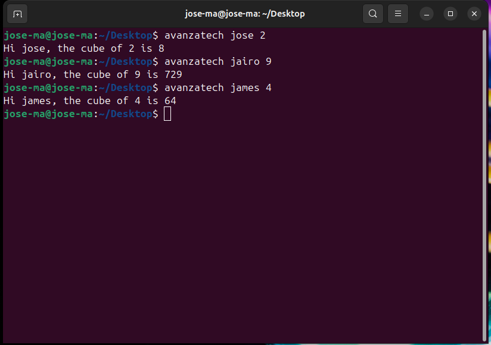

# Implementación de la Syscall `avanzatech`

## 1. Configuración del Entorno
- **Código Fuente del Kernel**: Descargue el código fuente del kernel desde [kernel.org](https://www.kernel.org/).
- **Herramientas de Desarrollo**: descargue las librerias necesarias:

    ```bash
    sudo apt install gcc make libncurses-dev bison flex libssl-dev libelf-dev
    ```

## 3. Implementación de la Syscall

### 3.1. Agregar la Syscall al Kernel

1. **Modificar `syscall_64.tbl`**:
   Abri el archivo `arch/x86/entry/syscalls/syscall_64.tbl` y agregue la siguiente línea:

   ```
   336     common  avanzatech              sys_avanzatech
   ```

2. **Agregar la Función en `sys.c`**:
   Abri el archivo `kernel/sys.c` y agregue el siguiente codigo:

   ```c
   #define MAX_DEST_BUFFER_LENGTH 2048
    #define MAX_NUMBER 2000000
    #define MAX_USERNAME_LENGTH 100 // Definir un límite para el username

    SYSCALL_DEFINE3(avanzatech, int, number, char __user *, dest_buffer, char __user *, username)
    {
        char kernel_dest_buffer[MAX_DEST_BUFFER_LENGTH] = {0}; // buffer a enviar
        char name_user[MAX_USERNAME_LENGTH] = {0}; // buffer para username
        long long res;

        // Validar el número
        if (number <= 0 || number > MAX_NUMBER) 
            return -EINVAL; // Número inválido

        // Copiar username de usuario a kernel
        if (copy_from_user(name_user, username, sizeof(name_user) - 1) != 0) 
            return -EFAULT; // Fallo al copiar username

        name_user[sizeof(name_user) - 1] = '\0'; // Asegurarse de que termine en null

        // Verificar que el username no esté vacío
        if (strlen(name_user) == 0) 
            return -EINVAL; // Username vacío

        // Calcular el cubo de number
        res = (long long)number * number * number;

        // Mensaje de respuesta
        snprintf(kernel_dest_buffer, sizeof(kernel_dest_buffer), "Hi %s, the cube of %d is %lld", name_user, number, res);

        // Verificar longitud del buffer de destino
        if (strlen(kernel_dest_buffer) >= MAX_DEST_BUFFER_LENGTH)
            return -EINVAL; // Buffer de destino demasiado largo

        // Enviar la respuesta al buffer del usuario
        if (copy_to_user(dest_buffer, kernel_dest_buffer, strlen(kernel_dest_buffer) + 1) != 0)
            return -EFAULT; // No se pudo enviar la respuesta al usuario


        return 0; // Éxito
    }
   ```

### 3.2. Recompilación del Kernel

```bash
make -j12
sudo make modules_install
sudo make install
```
Reinicia el sistema y selecciona el nuevo kernel.

## 4. Pruebas de la Syscall

### 4.1. Programa de Prueba en Espacio de Usuario

```c
#include <stdio.h>
#include <stdlib.h>
#include <unistd.h>
#include <sys/syscall.h>

#define SYS_avanzatech 336  

int main(int argc, char *argv[]) {
    if (argc != 3) {
        fprintf(stderr, "Uso: %s <username> <number>\n", argv[0]);
        return 1; // Falta de argumentos
    }

    char dest_buffer[2048]; // Buffer para la respuesta

    long result = syscall(SYS_avanzatech, atoi(argv[2]), dest_buffer, argv[1]); // llamada a la syscall

    if (result < 0) {
        perror("Error en la syscall");
        return 1; // Error haciendo la syscall
    }

    printf("%s\n", dest_buffer); // imprimiendo el resultado de la syscall

    return 0; // Éxito
}

```

### 4.2. Entradas y Salidas Esperadas



## 6. Recursos Adicionales

- **Documentación del Kernel**: Proporciona enlaces a recursos relevantes sobre el kernel y programación en C.
    - [The Linux Kernel documentation](https://www.kernel.org/doc/html/latest/)
    - [Kernel.org Git repositories](https://git.kernel.org/)

## 7. Seguridad y Mejores Prácticas

- **Manejo de Errores**: verificar y manejar adecuadamente los errores en la programación del kernel para evitar fallos y comportamientos inesperados. Cada llamada a funciones que interactúan con el espacio de usuario debe ser validada para asegurar que no haya errores de copia o accesos inválidos.

- **Prácticas de Codificación Segura**: La gestión segura de memoria y el manejo de buffers son esenciales para prevenir vulnerabilidades como desbordamientos de buffer y accesos no autorizados. Siempre se deben utilizar funciones seguras para copiar datos y verificar los límites de los buffers antes de realizar operaciones de escritura o lectura.

- **Validación de Entradas**: Asegúrate de validar todas las entradas provenientes del espacio de usuario. Esto incluye verificar que los punteros no sean nulos, que los tamaños de los buffers sean adecuados y que los datos sean consistentes y seguros para procesar.


---